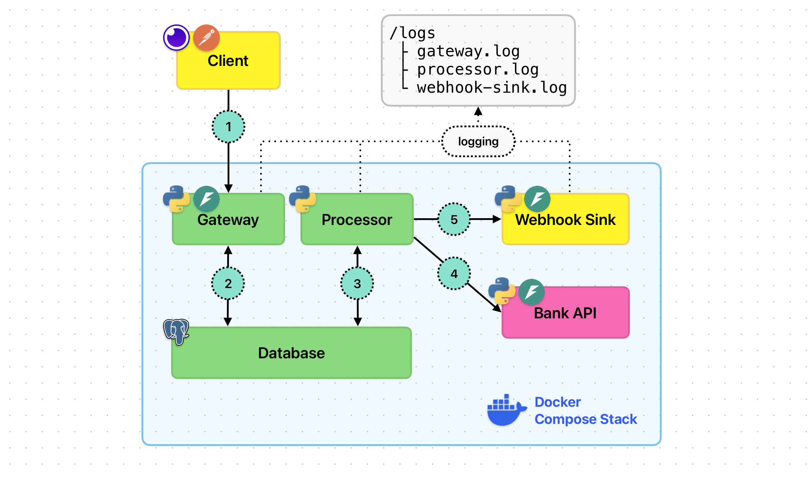

# Support Engineer Playground 🚧

### Fintech Environment:
This playground utilizes a distributed ***Payment Gateway*** to simulate the high-pressure reality of mission-critical support, where technical errors have direct financial implications. 

By focusing on fintech, the sandbox reflects a production environment where maintaining system reliability and transaction integrity is essential to protecting the trust and capital of every merchant on the platform.

As a case-based practice environment, the core of this repository is a [series of simulated tickets](#3-ticket-gallery-) that recreates the daily challenges of a Support Engineer. You will navigate real-world scenarios involving complex debugging, fragmented logs, and the high-stakes communication required when resolving issues for frustrated users with limited initial information.

### Content:
- [1. Mission 🎯](#1-mission-)
- [2. Who is this for? 🛠️](#2-who-is-this-for-️)
- [3. Ticket Gallery 📁](#3-ticket-gallery-)
- [4. System Architecture 🏛️](#4-system-architecture-️)
    - [4.1 The Overview](#41-the-overview)
    - [4.2 The Data Flow](#42-the-data-flow)
    - [4.3 System Design & Constraints](#43-system-design--constraints)
    - [4.4 Hardcoded Issues](#44-hardcoded-issues)
- [5. How to run ▶️](#5-how-to-run-️)
    - [5.1 Download & Deployment](#51-download--deployment)
    - [5.2 Make The First Request](#52-make-the-first-request)
    - [5.3 Chaos Automation](#53-chaos-automation)
- [6. Development & Contribution 🏗️](#6-development--contribution-️)

## 1. Mission 🎯

There is an outdated stereotype that technical support is a *"script-reader"* limited to resetting passwords or asking, *"Have you tried to restart your computer?"* In reality, the most valuable experts in the modern SaaS are those who can dive into the system and create a mental map of what they are maintaining. 

Modern technical support is a hybrid role. You aren't just a filter for tickets; you are a multidisciplinary expert who can navigate a codebase, audit the logs, and secure customer loyalty during their most critical moments of frustration. This repository serves as a developing lab for that exact persona.

## 2. Who is this for? 🛠️

This project is a playground for any roles that require hands-on experience in maintenance of complex systems:</br> `Developers` `SysAdmins` `DevOps` `QA` `Technical Support` `Cybersecurity` `Managers` etc.

You will find yourself dealing with the "uncomfortable" side of software — the stuff that usually happens at Saturday 3:00 AM in production:

- 💾 ***Database Forensics:***</br>
You will figure out CRUD operations, connection management, transaction integrity, and identifying silent resource leaks that threaten system stability.

- 🏗️ ***Architectural Bottlenecks:*** </br>
Experience how system design choices behave under pressure. You’ll learn to identify where a single downstream dependency can become a systemic point of failure.

- ⚖️ ***Scaling Challenges:*** </br>
Explore the transition from a "stable" system to a high-velocity environment. This playground simulates the exact moment when business growth turns minor technical debt into a critical service outage.

- 🌐 ***Globalization & Regional Logic:*** </br>
Master the nuances of the global market. You’ll tackle the non-obvious complexities of time-zone normalization, data casting, and regional discrepancies that often result in "phantom" data loss for international users.

- 📦 ***Microservice Management:*** </br>
Learn to navigate the "connective tissue" between services. You will practice tracking a single request across multiple logs and containers, identifying exactly where the communication chain breaks in a distributed architecture.

- 👔 ***High-Stakes Communication:*** </br>
Practice the art of "Technical Translation." You’ll learn how to take the raw, chaotic data from a system failure and transform it into a professional escalation for developers and a reassuring, empathetic update for stakeholders.


## 3. Ticket Gallery 📁
This is a collection of packed Support Engineer cases — documented investigations into failures that simulate the environment of a Tier 2 Support.

Each ticket report follows a decision chain framework: it begins with the initial ticket or escalation from Tier 1 and follows to the raw log analysis, the database audit, and communication across teams.

Tickets are stored in `tickets/` folder. Here is the list of content:

|Ticket ID|Case Name|Challenge|Link|
|---|---|---|---|
|01|State Inconsistency|Client reports that his payment is authorized by bank but stuck at "processing" status in our Payment Gateway dashboard|[Ticket-01-State-Inconsistency.md](./tickets/Ticket-01-State-Inconsistency.md)|
|02|Resource Exhaustion|Payment Gateway experienced a significant degradation in webhook delivery performance, with delays exceeding 30 minutes|[Ticket-02-Resource-Exhaustion.md](./tickets/Ticket-02-Resource-Exhaustion.md)|
|03|Timezone Logic|A client based in Sydney reported a discrepancy in daily report. While possessed 25 receipts for the day, the system-generated report only returned 19 records|[Ticket-03-Timezone-Logic.md](./tickets/Ticket-03-Timezone-Logic.md)|
|04|Database Pool Leak|During rapid scaling Payment Gateway experienced recurring daily service outages, resulting in `Internal Server Error` responses and a total cessation of payment processing during peak hours|[Ticket-04-DB-Pool-Leak.md](./tickets/Ticket-04-DB-Pool-Leak.md)|
|05|Coming Soon|Coming Soon|Coming Soon|

## 4. System Architecture 🏛️

### 4.1 The Overview
Project imitates interaction between three (3) parties: Client, Payment Gateway and Bank. Underneath it's five (5) Docker containers. Here's the breakdown on structure:

- 🟡 Client
    - Insomnia/Postman/cURL: Not a Docker container but logically part of "Client" block that initiates payments.
    - Webhook Sink: Docker container with simple HTTP listener that logs all incoming requests - simulates webhook URL of a client. This is where the client expects to get a result of a transaction.
- 🟢 Payment Gateway (implements microservice architecture).
    - Gateway: Docker container with API that customers interact with. Gateway can create new payments in the Database and check its status.
    - Processor: Docker container with worker that polls Database and handles the payment authorization through the bank, updates Database and sends a webhook to a client's Webhook Sink.
    - Database: Docker container with PostgreSQL that contains records about payments, events and webhook delivery.
- 🟣 Bank: Docker container with simple HTTP server meant to simulate bank API.

### 4.2 The Data Flow:

1. **Entry point:** User sends a POST request to /pay route of Gateway. Request is initiated on host machine and targets Gateway container inside of Docker Compose Stack *(default URL: `http://localhost:8000`)*.

2. **Payment initialization:** Gateway puts the record in a database with information about new payment, thus, creating a "job" for Processor.

3. **Processing:** Processor is an independent background worker that polls database every few seconds looking for new payments. It picks up newly created payment and updates its status from 'created' to 'processing'.

4. **Bank authorisation:** The processor sends a POST request to the bank to authorize the payment and gets a response with bank reference and status. Then it updates the payment record in a database. 

5. **Webhook delivery:** The processor sends a POST request to a webhook URL provided by the customer. No matter what is the response, Processor just puts the record in a webhook-deliveries table and moves on.

- **Logging:** Gateway, Processor and Webhook Sink log their activity to the Container file system. The container folder with logs is synchronized with the `logs/` folder on the host machine via bind mount. It ensures that logs are persistent even if containers are deleted.

This diagram visualizes data flow and relationships between components of a system.</br>
Blocks inside of Docker Compose Stack are Docker containers. Outside - Host Machine.</br>




⚠️ IMPORTANT: Database storage is also persistent and mounted to host machine via named volume. For more details, check `docker-compose.yaml`

### 4.3 System Design & Constraints:
1.  **"Mock" nature of a system**</br>
Although it is named a Payment Gateway, it **doesn't** reproduce the architecture of real payment gateways and is not meant to follow fintech industry standards. It's only a surface for general production-like challenges that could occur in any system, regardless of the domain. Idea behind it: if we can't make a lesson out of it - we ain't doing it.
2. **No Auth**</br> 
There's no authentification implemented between customer and gateway, and authentification between processor and mock bank is done by hardcoded API key.
3. **No 'users' table**</br> 
Users are not defined by account, login, password. You can only provide a "customer_id" when sending a request to /pay route, in order to imitate different merchants.
4. **One-try Processing policy**</br> 
The processor only tries ONCE to request the bank and ONCE to send the payload to the client's webhook URL. No matter what the reason, he doesn't bother himself with retrying.
5. **No retry worker**</br> 
While One-try Processing policy assumes there must be a background worker that polls the database and picks up payments with 'retry' status, and it is not implemented in a system.
6. **Hardcoded issues**</br>
Some failure points are pre-designed in different parts of the Payment Gateway itself. It lets you trigger edge cases predictably. Detailed breakdown will be given below.

*IMPORTANT: The project is in early stage. Constraints and System Design is an item for [further changes](#6-development--contribution-️).*

### 4.4 Hardcoded Issues
Failure trigger mechanics were implemented on the side of third parties: Bank and Webhook Sink. It lets you trigger the specific scenarios simply by tweaking parameters in request `JSON Body`, without hassle of changing variables in code and container restart - right when everything is up and running:

They trigger common scenarios such as: latency, 4XX and 5XX errors. Here's a brief reference for Bank and Webhook Sink services:

#### Bank:
| Parameter | Value | Code/Result |
|---|---|---|
|`amount_minor`|9999|[200] Responce delayed for 1-3s|
|`amount_minor`|4002|[402] 'Insufficient Funds'|
|`amount_minor`|5000|[500] 'Internal Server Error'|

#### Webhook Sink:
| Parameter | Value | Code/Result |
|---|---|---|
|`webhook_url`|`http://webhook-sink:8080/success`|[200] Dufault success delivery|
|`webhook_url`|`http://webhook-sink:8080/client-error`|[400] 'Invalid payload format'|
|`webhook_url`|`http://webhook-sink:8080/server-error`|[500] 'Internal Server Error'|
|`webhook_url`|`http://webhook-sink:8080/slow-poke`|[200] Responce delayed for 45s|

## 5. How to run ▶️

* ⚠️ ***Required:*** Docker
* ☘️ ***Optional:*** Insomia/Postman, pgAdmin

### 5.1 Download & deployment

1. Verify that Docker is installed: `$ docker --version`
2. Clone the repository: `$ git clone <repository-url>`
3. Move to the project folder: `$ cd <repository-name>`
4. Deploy containers: `$ docker compose up -d`

🎉 Congratulations! You've just deployed the whole system. Now you can verify it in your Docker Desktop or check the processes through terminal: `$ docker compose ps`

- ⏸️ STOP containers: `$ docker compose stop`
- ▶️ START containers: `$ docker compose start` 
- 🚫 DELETE containers: `$ docker compose down` (deletes the containers)
- ☢️ DELETE containers and volumes: `$ docker compose down -v` (deletes the containers and database)

Note: if you've shut down containers via `$ docker compose down` and want run them again, you need to deploy them via `$ docker compose up -d`.

### 5.2 Make the first request

Let's send the first payment. Create follwoing request in Insomia or Postman:

<table>
<tr> <td>  </td> <td>  </td></tr>
<tr>
<td>URL</td>
<td> 

`http://localhost:8000/pay` 

</td>
</tr>
<tr>
<td> JSON Body </td>
<td>

```json
{
  "order_id": "ORD_I179DLGU",
  "idempotency_key": "d9c0032f-4530-41cd-8966-9707a56ea499",
  "amount_minor": "18919",
  "currency": "USD",
  "description": "Lorem ipsum dolor sit amet",
  "customer_id": "shop_970438395",
  "customer_email": "Sharon.Mitchell34@yahoo.com",
  "payment_token": "token_dd872db3140a",
  "webhook_url": "http://webhook-sink:8080/success"
}
```

</td>
</tr>
</table>

Or, if you prefer curl:
```bash
curl --request POST \
  --url http://localhost:8000/pay \
  --header 'Content-Type: application/json' \
  --data '{
  "order_id": "ORD_I179DLGU",
  "idempotency_key": "d9c0032f-4530-41cd-8966-9707a56ea499",
  "amount_minor": 18919,
  "currency": "USD",
  "description": "Lorem ipsum dolor sit amet",
  "customer_id": "shop_970438395",
  "customer_email": "Sharon.Mitchell34@yahoo.com",
  "payment_token": "token_dd872db3140a",
  "webhook_url": "http://webhook-sink:8080/success"
}'
```

If you get a response like this:
```json
{
	"payment_id": "45caaada-ab5d-4628-a9d6-918fee42100c",
	"correlation_id": "3688ffc1-1264-4db3-a491-17262eabadd0",
	"status": "created"
}
```
🎉 Congratulations! You've sent the payment and it was processed successfully (probably the last time)

### 5.3 Automation

Sometimes you need to create a volume of hundreds of transactions - to inject a bug or test the system under pressure. To automate the generation of random data you can use a **Pre-Request script**.

This Pre-request script generates unique body for each request automatically, and lets you tweak some inputs in order to trigger scenarios you want, including [Hardcoded Isssues](#44-hardcoded-issues). Here is how to do it in **Insomnia**:

1. Open "Scripts" tab.
2. Select the "Pre-request" option.
3. Paste the following code to editor:
    ```javascript
    const uuid = require('uuid');
    const crypto = require('crypto-js');

    /* ===== TWEAK PARAMETERS [START] ===== */

    const bank_chaos_prob = 1; // 1% probability of chaos on bank side
    const client_chaos_prob = 1; // 1% probability of chaos on client side

    const chaosRoutes = [
        "http://webhook-sink:8080/client-error", // 400 ERROR
        "http://webhook-sink:8080/server-error", // 500 ERROR
        "http://webhook-sink:8080/slow-poke"     // High Latency (45s)
    ];

    const chaosAmounts = [
        9999, // High Latency (1-3s)
        4002, // 402 ERROR Insufficiend funds
        5000, // 500 ERROR Internal Server Error
        7777  // 200 Malformed Success
    ];

    /* ===== TWEAK PARAMETERS [END] ===== */

    const randomOrderSuffix = Math.random().toString(36).substring(2, 10).toUpperCase();
    const orderId = `ORD_${randomOrderSuffix}`;
    let amountMinor = Math.floor(Math.random() * 100000) + 100;
    let customerId = `shop_${Math.floor(Math.random() * 999999999)}`;
    const paymentToken = `token_${crypto.lib.WordArray.random(6).toString()}`;
    let webhookUrl = "http://webhook-sink:8080/success";

    const roll1 = Math.random();
    const roll2 = Math.random();

    if (roll1 < client_chaos_prob/100) {
        webhookUrl = chaosRoutes[Math.floor(Math.random() * chaosRoutes.length)];
    }

    if (roll2 < bank_chaos_prob/100) {
        amountMinor = chaosAmounts[Math.floor(Math.random() * chaosAmounts.length)];
    }

    insomnia.environment.set("dyn_order_id", orderId);
    insomnia.environment.set("dyn_idempotency", uuid.v4());
    insomnia.environment.set("dyn_amount", amountMinor);
    insomnia.environment.set("dyn_customer_id", customerId);
    insomnia.environment.set("dyn_token", paymentToken);
    insomnia.environment.set("dyn_webhook", webhookUrl);
    ```

4. Update the JSON Body:
    ```json
    {
        "order_id": "{{ dyn_order_id }}",
        "idempotency_key": "{{ dyn_idempotency }}",
        "amount_minor": "{{ dyn_amount }}",
        "currency": "USD",
        "description": "",
        "customer_id": "{{ dyn_customer_id }}",
        "customer_email": "",
        "payment_token": "{{ dyn_token }}",
        "webhook_url": "{{ dyn_webhook }}"
    }
    ```

**🎉 Congratulations!**</br>
Now you can generate any volume of traffic with controllably injected flaws. Good luck debugging it 🫡

## 6. Development & Contribution 🏗️

**Current stage:** </br>
At the moment this is a simplified API with microservice architecture and simulation of third parties.

**Goal:** </br>
The project aims to provide a near-production experience of working with SaaS. It implies usage of production tools, corresponding architecture and challenges, developed from the perspective of people who keep it alive and are on the frontline of customer communication.

### Roadmap:

|Status|Task|Motivation|Date|
|------|----|----|---|
|-|Add a Reverse Proxy|In the current version, the client reaches out our API directly by its port, which is heavy simplification. In production, we don't want to expose the infrastructure, so we hide it behind the Reverse Proxy. It's an entry point for a user and a gatekeeper of backend, also handling routing, caching, and SSL certification.|-|
|-|Refactor Webhook delivery logic|In the current version, Processor handles both bank request and webhook delivery, which is a temporary solution that may not meet production standards. Instead it's more profitable to delegate the webhook delivery job to separate worker and use message broker like RabbitMQ to feed it with jobs.|-|
|-|Define a User & Authentification|In the current version the only thing that defines a user is random customer_id in the request body, which is way too abstract. It should be changed by defining a persistent user account in the database, with name, id, API key and some metadata. It will also imply a simple authentication by API key.|-|
|-|Network Segmentation|In the current version, all containers are deployed under the same network that is fully open to the host. In production we don't want anyone to ping your internal infrastructure, so we segment the network to: public - for reverse proxy, accessed from host; internal - for app layer, only accessed by proxy; isolated - for database and logs, only accessed by app layer. Thus we build a Zero Trust Architecture that is an industrial standard for SaaS.|-|
|-|Log Aggregation|In current version logs are written to the host machine via bind mount, but in production common practice is Log Aggregation: a system that collects, normalizes and centralizes logs from multiple containers, making them persistent and easier to analyze.|-|
|-|Log Visualization|Nearly universal component of SaaS as well. Data visualization tools provide user-friendly experience of working with logs: diagrams, charts, dashboards, etc.|-|
|-|Helpdesk UI|This is a step forward in the educational side of this project. Right now, the system requires you to manually trigger the cases which is necessary for reproduction and understanding of a system. On the other hand, it makes you witness the "cause" of the ticket even before you start resolving it, which eventually kills the element of "surprise".</br></br>Instead, you will be in front of the helpdesks interface, with the ability to play scenarios at single click. Core differences are:</br></br>1. Here you naturally move from symptoms to cause: you don't know what happened unless you carefully read the ticket full of user frustration and walk through the logs and databases to resolve the issue.</br></br>2. Full immersion to the customer communication: you do have a chat with the user that opened the ticket. Although it's gonna be an AI bot underneath, this is what makes it a production-like experience rather than just a hard skill test. It will take all of you: technical literacy, stakeholder translation, customer communication and empathy.|-|
---
