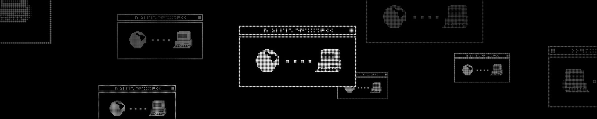
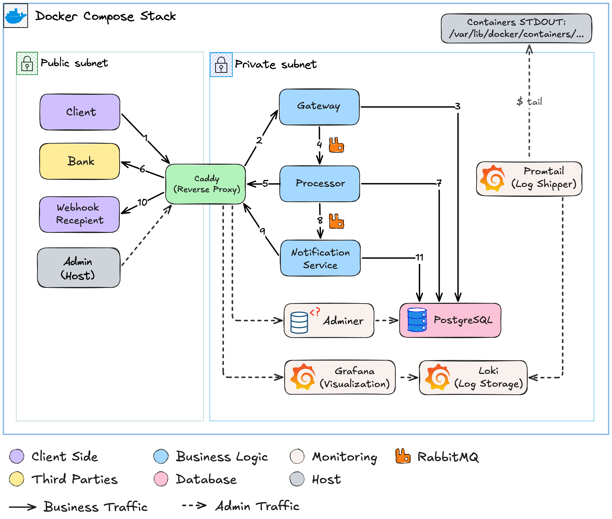

# Payment Gateway — Support Engineer Playground 🚧



A self-contained mock payment processing system running on Docker Compose.
Built to replicate the operational complexity of a real SaaS payment platform
at a scale that runs on a laptop.

The system covers a full payment lifecycle: REST intake, async processing
via message queue, bank communication, and webhook delivery. Services are
network-isolated into public and private subnets, log structured JSON, and
ship to a centralized observability stack (Promtail + Loki + Grafana)
included out of the box.

**Upcoming:** injected failure scenarios and incident resolution guides — making
this a diagnostic playground for engineers who want to practice root-cause
analysis on a realistic distributed system.

## Branches

| Branch | Purpose |
|---|---|
| `main` | Clean, working system. Up-to-date architecture, actively developed. |
| `playground` | Same system with injected failures and incident scenarios. Currently based on an earlier architecture — see `main` for the latest. |

New to the project? **Clone `main` first** to understand the system, then switch to `playground` to break it.

```bash
# Run the clean system
git clone https://github.com/jesterlime/support-engineer-playground.git
cd support-engineer-playground
docker compose up -d
```

```bash
# Switch to the diagnostic experience
git checkout playground
docker compose up -d
```

## Contents

- [1. System Architecture](#1-system-architecture)
  - [1.1 Overview](#11-overview)
  - [1.2 Payment Flow](#12-payment-flow)
  - [1.3 Observability](#13-observability)
  - [1.4 Design Constraints](#14-design-constraints)
- [2. API Reference](#2-api-reference)
- [3. How to Run](#3-how-to-run)
  - [3.1 Setup](#31-setup)
  - [3.2 First Payment](#32-first-payment)
  - [3.3 Load Generation](#33-load-generation)
- [4. Ticket Gallery](#4-ticket-gallery)
- [5. Roadmap](#5-roadmap)


## 1. System Architecture

### 1.1 Overview

The system simulates interaction between three parties: a Client, a Payment Gateway, and a Bank. It runs as a Docker Compose stack with two isolated networks that mirror a real VPC setup.

**Public subnet** — externally reachable:

| Service | Technology | Role |
|---|---|---|
| `reverse-proxy` | Caddy | Reverse proxy, sole entry point for all inbound and outbound traffic |
| `bank` | FastAPI | Mock bank API |
| `webhook-sink` | FastAPI | Webhook receiver — logs all incoming webhook deliveries |

**Private subnet** — sits behind Caddy, internal only, not reachable from outside the stack:

| Service | Technology | Role |
|---|---|---|
| `gateway` | FastAPI/Uvicorn | Payment API — accepts requests, writes to database, pushes task to queue for processor |
| `processor` | Python | Consumes events from message queue, handles bank authorization, pushes task to queue for notification service |
| `notification-service` | Python | Consumes events from message queue, delivers webhook to the client |
| `db` | PostgreSQL 16 | Persistent records about payments, events, and deliveries |
| `message-broker` | RabbitMQ | Async message queue between gateway, processor and notification service |
| `db-admin` | Adminer | Lightweight database UI |
| `loki` | Grafana Loki | Centralized log storage |
| `promtail` | Grafana Promtail | Log collector and shipper |
| `grafana` | Grafana | Log visualization and exploration |



---

### 1.2 Payment Flow

This flow map reflects the numbering on the diagram above.

1. **Entry point** — Client sends `POST /pay` to `http://localhost/api`.
2. **Routing** — Request is routed by Caddy to Gateway and passes validation.
3. **Payment record** — Gateway writes a payment record to the database with status `created`.
4. **Processing queue** — Gateway publishes payment metadata to the queue for Processor.
5. **Processing** — Processor consumes the message, fetches the payment record, updates status to `processing`, and sends an authorization request to the bank.
6. **Bank response** — Request is routed by Caddy to the Bank, which returns an authorization result.
7. **Record update** — Processor updates the payment status in the database accordingly.
8. **Notification queue** — Processor publishes payment metadata to the queue for Notification Service.
9. **Webhook delivery** — Notification Service consumes the message and delivers the webhook to the client's URL.
10. **Delivery response** — Request is routed by Caddy to the client's webhook server, which returns a response.
11. **Delivery record** — Result of the delivery attempt is recorded in the database.

---

### 1.3 Observability

#### 1.3.1 Log monitoring via Grafana

All services emit structured JSON logs to stdout. Docker captures these and Promtail ships them to Loki with a purposeful label hierarchy:

| Label | Values | Purpose |
|---|---|---|
| `category` | `business`, `infra`, `data`, `monitoring` | Group queries by system layer |
| `service` | `gateway`, `processor`, `notification-service`, etc. | Filter by individual service |
| `container_name` | exact container name | Pinpoint specific instance |

</br>

Categories (system layers) according to `category` label

| Category | Services | Description |
|---|---|---|
| `business` | `gateway` `processor` `notification-service` | Payment flow business logic |
| `infra` | `reverse-proxy` | Network layer — all inbound and outbound traffic |
| `data` | `db` `message-broker` | Persistent storage and messaging |
| `monitoring` | `grafana` `loki` `promtail` `adminer` | Observability and database administration |

**Grafana** is available at [`http://localhost/logs`](http://localhost/logs)

Useful LogQL queries to get started:

```logql
# Follow a specific payment across all services
{category="business"} | json | payment_id="<id>" correlation_id="<id>"

# All errors across business logic
{category="business", level="error"}

# Caddy access log + business logic together
{category=~"business|infra"} | json
```

#### 1.3.2 Database administration with Adminer

**Adminer** is available at [`http://localhost/database`](http://localhost/database)

A lightweight database UI for inspecting PostgreSQL directly — useful for
verifying payment records, auditing table state, and cross-referencing what
the logs say against what actually landed in the database.

**Login credentials:**

| Field | Value |
|---|---|
| System | PostgreSQL |
| Host/Server | `db` |
| Username | `gateway_user` |
| Password | `gateway_pass` |
| Database | `payments` |

The `payments` database contains three tables:

| Table | Contents |
|---|---|
| `payments` | Every payment record with status, amount, bank reference, and timestamps |
| `payment_events` | Status transition log — tracks every state change a payment goes through |
| `webhook_deliveries` | Webhook delivery attempts with response codes and timestamps |

A typical investigation flow: spot an anomaly in Grafana logs, grab the
`payment_id`, then query Adminer to see the exact database state at that
moment — whether the record exists, what status it landed on, and whether
the webhook delivery was attempted.

---

### 1.4 Design Constraints

This system deliberately simplifies some aspects of a real payment gateway. These are known constraints, not gaps:

1. **Mock architecture** — Does not reproduce fintech industry standards or compliance requirements. The domain exists to provide realistic operational scenarios, not to model a real payment processor.

2. **No authentication** — No customer authentication between client and gateway. Bank authentication is a hardcoded API key.

3. **No user accounts** — Merchants are identified by a `customer_id` field in the request body only.

4. **Single-attempt processing** — Processor makes one attempt at bank authorization and one attempt at webhook delivery. No retry logic is implemented.

5. **Hardcoded failure triggers** — Bank and Webhook Sink respond to specific input values with predictable failures, enabling controlled scenario reproduction without code changes:

**Bank triggers:**

| `amount_minor` | Result |
|---|---|
| `9999` | `[200]` Response delayed 1–3s |
| `4002` | `[402]` Insufficient funds |
| `5000` | `[500]` Internal server error |

**Webhook Sink routes:**

| `webhook_url` | Result |
|---|---|
| `.../success` | `[200]` Default success |
| `.../client-error` | `[400]` Invalid payload |
| `.../server-error` | `[500]` Internal server error |
| `.../slow-poke` | `[200]` Response delayed 45s |

> Some constraints are temporary and will be addressed as the project evolves. See [Roadmap](#5-roadmap).

---

## 2. API Reference

Gateway API reference → [`gateway/API_REFERENCE.md`](./gateway/API_REFERENCE.md)

## 3. How to Run

**Required:** Docker  
**Optional:** Insomnia / Postman

### 3.1 Setup

```bash
# Verify Docker is installed
docker --version

# Clone and enter the repository
git clone https://github.com/jesterlime/support-engineer-playground.git
cd support-engineer-playground

# Start the stack
docker compose up -d

# Verify all containers are running
docker compose ps
```

**Useful commands:**

```bash
docker compose stop        # pause containers, preserve state
docker compose start       # resume paused containers
docker compose down        # remove containers
docker compose down -v     # remove containers and wipe database
```

> After `docker compose down`, containers are deleted — use `docker compose up -d` to recreate them, not `start`.

---

### 3.2 First Payment

Send a `POST` request to `http://localhost/api/pay`:

```bash
curl --request POST \
  --url http://localhost/api/pay \
  --header 'Content-Type: application/json' \
  --data '{
    "order_id": "ORD_I179DLGU",
    "idempotency_key": "d9c0032f-4530-41cd-8966-9707a56ea499",
    "amount_minor": 19919,
    "currency": "USD",
    "description": "Lorem ipsum dolor sit amet",
    "customer_id": "shop_970438395",
    "customer_email": "Sharon.Mitchell34@yahoo.com",
    "payment_token": "token_dd872db3140a",
    "webhook_url": "http://reverse-proxy/webhook/success"
  }'
```

Expected response:

```json
{
  "payment_id": "45caaada-ab5d-4628-a9d6-918fee42100c",
  "correlation_id": "3688ffc1-1264-4db3-a491-17262eabadd0",
  "status": "created"
}
```

Then follow the payment through Grafana at [`http://localhost/logs`](http://localhost/logs) using the returned `payment_id` and `correlation_id`.

---

### 3.3 Load Generation

For volume testing or failure scenario reproduction, use this Pre-request script in Insomnia:

1. Open the **Scripts** tab → select **Pre-request**
2. Paste the script below
3. Update the JSON body to use the dynamic variables

```javascript
const uuid = require('uuid');
const crypto = require('crypto-js');

/* ===== TWEAK PARAMETERS ===== */
const bank_chaos_prob = 1;   // % chance of bank failure
const client_chaos_prob = 1; // % chance of webhook failure

const chaosRoutes = [
    "http://reverse-proxy/webhook/client-error",
    "http://reverse-proxy/webhook/server-error",
    "http://reverse-proxy/webhook/slow-poke"
];

const chaosAmounts = [9999, 4002, 5000];
/* ============================ */

const randomOrderSuffix = Math.random().toString(36).substring(2, 10).toUpperCase();
const orderId = `ORD_${randomOrderSuffix}`;
let amountMinor = Math.floor(Math.random() * 100000) + 100;
let customerId = `shop_${Math.floor(Math.random() * 999999999)}`;
const paymentToken = `token_${crypto.lib.WordArray.random(6).toString()}`;
let webhookUrl = "http://reverse-proxy/webhook/success";

if (Math.random() < client_chaos_prob / 100)
    webhookUrl = chaosRoutes[Math.floor(Math.random() * chaosRoutes.length)];

if (Math.random() < bank_chaos_prob / 100)
    amountMinor = chaosAmounts[Math.floor(Math.random() * chaosAmounts.length)];

insomnia.environment.set("dyn_order_id", orderId);
insomnia.environment.set("dyn_idempotency", uuid.v4());
insomnia.environment.set("dyn_amount", amountMinor);
insomnia.environment.set("dyn_customer_id", customerId);
insomnia.environment.set("dyn_token", paymentToken);
insomnia.environment.set("dyn_webhook", webhookUrl);
```

JSON body:

```json
{
  "order_id": "{{ dyn_order_id }}",
  "idempotency_key": "{{ dyn_idempotency }}",
  "amount_minor": "{{ dyn_amount }}",
  "currency": "USD",
  "description": "",
  "customer_id": "{{ dyn_customer_id }}",
  "customer_email": "",
  "payment_token": "{{ dyn_token }}",
  "webhook_url": "{{ dyn_webhook }}"
}
```


## 4. Ticket Gallery

> **Looking for the plug-and-play diagnostic experience?**
> The fully packed version with working incident scenarios lives on the
> [`playground` branch](../../tree/playground). It runs on a simpler architecture purpose-built
> for that experience — spin it up and start investigating immediately:

```bash
# Switch to the diagnostic experience
git checkout playground
docker compose up -d
```

The current architecture is being redesigned for a richer set of scenarios.
New tickets are planned once the infrastructure stabilizes. Track progress
in the [Roadmap](#4-roadmap).


## 5. Roadmap

| Status | Item |
|---|---|
| ✅ | Segment the network to Public and Private |
| ✅ | Add a Reverse-Proxy (Caddy) |
| ✅ | Refactor business logic to use RabbitMQ (Gateway -> Processor -> Notification Service pipeline) |
| ✅ | Setup the observability stack (Promtail + Loki + Grafana) |
| 🔲 | Pre-built Grafana dashboards (system overview, payment flow, error rates) |
| 🔲 | Define user accounts and implement API key authentication |
| 🔲 | Injected failure scenarios for updated architecture |
| 🔲 | Helpdesk UI with AI-powered customer communication simulation |